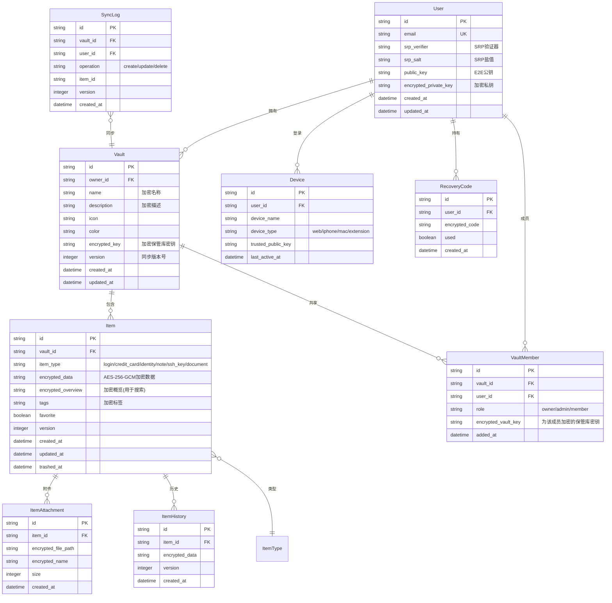

# VaultKey 密码管理器 - 技术架构文档

## 1. 架构设计

```mermaid
flowchart TB
    subgraph "客户端层"
        "Web App (React)"
        "浏览器插件 (Chrome MV3)"
        "iPhone App (SwiftUI)"
        "Mac App (SwiftUI + AppKit)"
    end

    subgraph "API 网关层"
        "Nginx 反向代理"
        "Rate Limiting"
        "CORS 策略"
    end

    subgraph "后端服务层"
        "Auth Service (认证服务)"
        "Vault Service (保管库服务)"
        "Sync Service (同步服务)"
        "Watchtower Service (安全服务)"
        "Share Service (共享服务)"
    end

    subgraph "数据层"
        "PostgreSQL (主数据库)"
        "Redis (会话/缓存)"
        "S3 (加密附件存储)"
    end

    subgraph "安全层"
        "SRP 协议 (安全远程密码)"
        "AES-256-GCM (数据加密)"
        "Argon2id (密钥派生)"
        "End-to-End Encryption (端到端加密)"
    end

    "Web App" --> "API 网关层"
    "浏览器插件" --> "API 网关层"
    "iPhone App" --> "API 网关层"
    "Mac App" --> "API 网关层"
    "API 网关层" --> "后端服务层"
    "后端服务层" --> "数据层"
    "后端服务层" --> "安全层"
```

## 2. 技术说明

### 2.1 Web 端

- **前端框架**：React 18 + TypeScript
- **样式方案**：Tailwind CSS 3 + CSS Modules
- **构建工具**：Vite 5
- **状态管理**：Zustand
- **路由**：React Router v6
- **加密库**：libsodium-wrappers (WebAssembly)
- **动画**：Framer Motion
- **图标**：Lucide React
- **表单**：React Hook Form + Zod 验证
- **HTTP 客户端**：Ky (基于 Fetch)

### 2.2 浏览器插件

- **框架**：Chrome Extension Manifest V3
- **UI 层**：React 18 (Popup + Options Page)
- **Content Script**：原生 JS，负责表单检测与自动填充
- **Background Service Worker**：处理密码生成、加密操作、与 Web App 同步
- **存储**：chrome.storage.local (加密数据)

### 2.3 iPhone 端

- **语言**：Swift 5.9+
- **框架**：SwiftUI + Combine
- **加密**：CryptoKit + libsodium
- **本地存储**：Core Data (加密 SQLite)
- **Keychain**：iOS Keychain Services 存储主密钥
- **生物识别**：LocalAuthentication (Face ID / Touch ID)
- **自动填充**：Credential Provider Extension (ASCredentialIdentityStore)
- **网络**：URLSession + async/await
- **最低支持**：iOS 16.0

### 2.4 Mac 端

- **语言**：Swift 5.9+
- **框架**：SwiftUI + AppKit
- **加密**：CryptoKit + libsodium
- **本地存储**：Core Data + macOS Keychain
- **生物识别**：LocalAuthentication (Touch ID)
- **全局快捷键**：HotKey 库
- **菜单栏**：AppKit NSStatusItem
- **自动填充**：通过浏览器插件桥接
- **最低支持**：macOS 13.0 (Ventura)

### 2.5 后端

- **运行时**：Node.js 20 LTS
- **框架**：Express 4 + TypeScript
- **数据库**：PostgreSQL 16
- **ORM**：Drizzle ORM
- **缓存**：Redis 7
- **认证**：SRP (Secure Remote Password) 协议
- **文件存储**：S3 兼容存储 (加密附件)
- **实时同步**：WebSocket (Socket.io)

## 3. 路由定义

| 路由 | 用途 |
|------|------|
| `/` | 重定向到仪表盘或登录页 |
| `/auth/login` | 登录页面 |
| `/auth/register` | 注册页面 |
| `/auth/recover` | 账户恢复页面 |
| `/unlock` | 保管库解锁页面 |
| `/dashboard` | 仪表盘首页 |
| `/items` | 项目列表页（全部） |
| `/items/logins` | 登录项目列表 |
| `/items/credit-cards` | 信用卡列表 |
| `/items/identities` | 身份信息列表 |
| `/items/secure-notes` | 安全笔记列表 |
| `/items/ssh-keys` | SSH 密钥列表 |
| `/items/documents` | 文档列表 |
| `/items/:id` | 项目详情/编辑页 |
| `/items/new` | 新建项目页 |
| `/generator` | 密码生成器 |
| `/watchtower` | 安全中心 |
| `/vaults` | 保管库管理 |
| `/settings` | 设置页 |
| `/settings/security` | 安全设置 |
| `/settings/appearance` | 外观设置 |
| `/settings/import-export` | 导入导出 |
| `/profile` | 个人资料页 |

## 4. API 定义

### 4.1 认证相关

```typescript
// SRP 注册
POST /api/auth/register
Request: {
  email: string;
  verifier: string;    // SRP 验证器
  salt: string;        // 盐值
  publicKey: string;   // 用户公钥 (用于 E2E 加密)
}
Response: {
  userId: string;
  accessToken: string;
  refreshToken: string;
}

// SRP 登录 - 第一步
POST /api/auth/login/init
Request: { email: string }
Response: {
  salt: string;
  serverEphemeral: string;
}

// SRP 登录 - 第二步
POST /api/auth/login/verify
Request: {
  email: string;
  clientEphemeral: string;
  clientProof: string;
}
Response: {
  serverProof: string;
  accessToken: string;
  refreshToken: string;
}

// 刷新令牌
POST /api/auth/refresh
Request: { refreshToken: string }
Response: { accessToken: string; refreshToken: string }
```

### 4.2 保管库相关

```typescript
// 获取保管库列表
GET /api/vaults
Response: Vault[]

// 创建保管库
POST /api/vaults
Request: {
  name: string;
  description?: string;
  icon?: string;
  color?: string;
  encryptedKey: string;  // 用主密钥加密的保管库密钥
}

// 获取保管库内项目
GET /api/vaults/:vaultId/items
Response: ItemSummary[]

// 同步变更
POST /api/sync/push
Request: {
  vaultId: string;
  changes: EncryptedChange[];
  lastSyncVersion: number;
}
Response: {
  serverVersion: number;
  conflicts?: Conflict[];
}

GET /api/sync/pull?vaultId=x&sinceVersion=y
Response: {
  changes: EncryptedChange[];
  latestVersion: number;
}
```

### 4.3 安全中心

```typescript
// 获取安全概况
GET /api/watchtower/summary
Response: {
  score: number;
  weakPasswords: number;
  reusedPasswords: number;
  compromisedPasswords: number;
  expiredItems: number;
}

// 检查密码泄露 (HIBP k-anonymity)
GET /api/watchtower/breach-check?prefix=:hashPrefix
Response: {
  matches: { suffix: string; count: number }[];
}
```

## 5. 服务端架构图

```mermaid
flowchart LR
    subgraph "API 层"
        "AuthController"
        "VaultController"
        "ItemController"
        "SyncController"
        "WatchtowerController"
    end

    subgraph "服务层"
        "AuthService"
        "VaultService"
        "ItemService"
        "SyncService"
        "EncryptionService"
        "WatchtowerService"
    end

    subgraph "数据层"
        "UserRepository"
        "VaultRepository"
        "ItemRepository"
        "SyncRepository"
    end

    "AuthController" --> "AuthService"
    "VaultController" --> "VaultService"
    "ItemController" --> "ItemService"
    "SyncController" --> "SyncService"
    "WatchtowerController" --> "WatchtowerService"

    "AuthService" --> "UserRepository"
    "AuthService" --> "EncryptionService"
    "VaultService" --> "VaultRepository"
    "VaultService" --> "EncryptionService"
    "ItemService" --> "ItemRepository"
    "ItemService" --> "EncryptionService"
    "SyncService" --> "SyncRepository"
    "SyncService" --> "ItemRepository"
    "SyncService" --> "VaultRepository"
    "WatchtowerService" --> "ItemRepository"

    "UserRepository" --> "PostgreSQL"
    "VaultRepository" --> "PostgreSQL"
    "ItemRepository" --> "PostgreSQL"
    "SyncRepository" --> "PostgreSQL"
    "SyncRepository" --> "Redis"
```

## 6. 数据模型

### 6.1 数据模型定义



### 6.2 数据定义语言

```sql
-- 用户表
CREATE TABLE users (
    id UUID PRIMARY KEY DEFAULT gen_random_uuid(),
    email VARCHAR(255) UNIQUE NOT NULL,
    srp_verifier TEXT NOT NULL,
    srp_salt TEXT NOT NULL,
    public_key TEXT NOT NULL,
    encrypted_private_key TEXT NOT NULL,
    created_at TIMESTAMPTZ DEFAULT NOW(),
    updated_at TIMESTAMPTZ DEFAULT NOW()
);

-- 保管库表
CREATE TABLE vaults (
    id UUID PRIMARY KEY DEFAULT gen_random_uuid(),
    owner_id UUID NOT NULL REFERENCES users(id) ON DELETE CASCADE,
    name TEXT NOT NULL,
    description TEXT,
    icon VARCHAR(50),
    color VARCHAR(7),
    encrypted_key TEXT NOT NULL,
    version INTEGER DEFAULT 1,
    created_at TIMESTAMPTZ DEFAULT NOW(),
    updated_at TIMESTAMPTZ DEFAULT NOW()
);

-- 项目表
CREATE TABLE items (
    id UUID PRIMARY KEY DEFAULT gen_random_uuid(),
    vault_id UUID NOT NULL REFERENCES vaults(id) ON DELETE CASCADE,
    item_type VARCHAR(20) NOT NULL CHECK (item_type IN ('login', 'credit_card', 'identity', 'note', 'ssh_key', 'document')),
    encrypted_data TEXT NOT NULL,
    encrypted_overview TEXT NOT NULL,
    tags TEXT[],
    favorite BOOLEAN DEFAULT FALSE,
    version INTEGER DEFAULT 1,
    created_at TIMESTAMPTZ DEFAULT NOW(),
    updated_at TIMESTAMPTZ DEFAULT NOW(),
    trashed_at TIMESTAMPTZ
);

-- 设备表
CREATE TABLE devices (
    id UUID PRIMARY KEY DEFAULT gen_random_uuid(),
    user_id UUID NOT NULL REFERENCES users(id) ON DELETE CASCADE,
    device_name VARCHAR(255) NOT NULL,
    device_type VARCHAR(20) NOT NULL,
    trusted_public_key TEXT,
    last_active_at TIMESTAMPTZ DEFAULT NOW()
);

-- 保管库成员表
CREATE TABLE vault_members (
    id UUID PRIMARY KEY DEFAULT gen_random_uuid(),
    vault_id UUID NOT NULL REFERENCES vaults(id) ON DELETE CASCADE,
    user_id UUID NOT NULL REFERENCES users(id) ON DELETE CASCADE,
    role VARCHAR(20) NOT NULL DEFAULT 'member' CHECK (role IN ('owner', 'admin', 'member')),
    encrypted_vault_key TEXT NOT NULL,
    added_at TIMESTAMPTZ DEFAULT NOW(),
    UNIQUE(vault_id, user_id)
);

-- 项目附件表
CREATE TABLE item_attachments (
    id UUID PRIMARY KEY DEFAULT gen_random_uuid(),
    item_id UUID NOT NULL REFERENCES items(id) ON DELETE CASCADE,
    encrypted_file_path TEXT NOT NULL,
    encrypted_name TEXT NOT NULL,
    size INTEGER NOT NULL,
    created_at TIMESTAMPTZ DEFAULT NOW()
);

-- 项目历史表
CREATE TABLE item_history (
    id UUID PRIMARY KEY DEFAULT gen_random_uuid(),
    item_id UUID NOT NULL REFERENCES items(id) ON DELETE CASCADE,
    encrypted_data TEXT NOT NULL,
    version INTEGER NOT NULL,
    created_at TIMESTAMPTZ DEFAULT NOW()
);

-- 同步日志表
CREATE TABLE sync_logs (
    id UUID PRIMARY KEY DEFAULT gen_random_uuid(),
    vault_id UUID NOT NULL REFERENCES vaults(id) ON DELETE CASCADE,
    user_id UUID NOT NULL REFERENCES users(id),
    operation VARCHAR(10) NOT NULL CHECK (operation IN ('create', 'update', 'delete')),
    item_id UUID,
    version INTEGER NOT NULL,
    created_at TIMESTAMPTZ DEFAULT NOW()
);

-- 恢复码表
CREATE TABLE recovery_codes (
    id UUID PRIMARY KEY DEFAULT gen_random_uuid(),
    user_id UUID NOT NULL REFERENCES users(id) ON DELETE CASCADE,
    encrypted_code TEXT NOT NULL,
    used BOOLEAN DEFAULT FALSE,
    created_at TIMESTAMPTZ DEFAULT NOW()
);

-- 索引
CREATE INDEX idx_items_vault_id ON items(vault_id);
CREATE INDEX idx_items_type ON items(item_type);
CREATE INDEX idx_items_favorite ON items(favorite) WHERE favorite = TRUE;
CREATE INDEX idx_items_trashed ON items(trashed_at) WHERE trashed_at IS NOT NULL;
CREATE INDEX idx_items_tags ON items USING GIN(tags);
CREATE INDEX idx_vaults_owner ON vaults(owner_id);
CREATE INDEX idx_devices_user ON devices(user_id);
CREATE INDEX idx_vault_members_user ON vault_members(user_id);
CREATE INDEX idx_sync_logs_vault_version ON sync_logs(vault_id, version);
CREATE INDEX idx_item_history_item ON item_history(item_id, version DESC);
```

## 7. 加密架构

### 7.1 密钥层级

```
主密码 (Master Password)
    └── Argon2id 派生 ──→ 主密钥 (Master Key)
            ├── 解密个人保管库密钥
            ├── 解密 SRP 验证器
            └── 解密 E2E 私钥

保管库密钥 (Vault Key) - 每个保管库独立
    └── AES-256-GCM 加密 ──→ 项目数据

项目密钥 (Item Key) - 每个项目独立 (可选)
    └── AES-256-GCM 加密 ──→ 敏感字段
```

### 7.2 端到端加密流程

1. **注册时**：主密码 → Argon2id → 主密钥；生成 E2E 密钥对
2. **创建保管库**：生成随机保管库密钥，用主密钥加密保管库密钥
3. **添加项目**：生成随机项目密钥，用保管库密钥加密项目密钥，用项目密钥加密数据
4. **共享保管库**：为每个成员用其公钥加密保管库密钥
5. **同步**：所有数据在客户端加密后上传，服务器仅存储密文

## 8. 多平台代码共享策略

```
vaultkey/
├── packages/
│   ├── core/              # 共享核心逻辑 (加密、数据模型、API 客户端)
│   │   ├── crypto/        # 加密/解密、密钥派生
│   │   ├── models/        # 数据模型定义
│   │   ├── api/           # API 客户端
│   │   └── sync/          # 同步引擎
│   ├── web/               # Web 应用
│   ├── extension/         # 浏览器插件
│   ├── ios/               # iPhone 应用 (Xcode 项目)
│   └── mac/               # Mac 应用 (Xcode 项目)
├── server/                # 后端服务
└── shared/                # 跨平台共享配置
```
